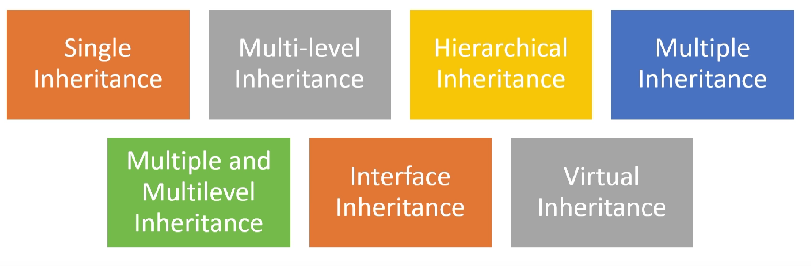

__Bölümde neler var__
- Kalıtım(Inheritance)
- Inheritance da Constructer
- Çok Biçimlilik(Polymorphism)


---
## Kalıtım(Inheritance)
- Kalıtım bir nesnenin başka bir nesnenin özelliklerini devralmasınıdır. Bir çocuğun annesinden ve babasından çeşitli özellikleri ve davranışlarını alması olarak örnek verebiliriz.
- Kalıtım bir sınıfın özelliklerinin, davranışlarının ve yöntemlerinin başka bir sınıf tarafından devralınabilmesini sağlar. Böylece yeni bir sınıf bir önceki sınıfın tüm özelliklerini ve davranışlarını miras alır ve bunların üzerinde değişiklikler yapabilir.
- Kullanım alanı olarak, birden fazla nesnenin ortak özelliği olduğunu varsayalım, bunun için kodları her sınıf için tekrar tekrar yazmak yerine bir tane super/base class dediğimiz sınıf oluşturup ortak özellikleri kalıtım ile sub/alt sınıflara iletiriz.


```java
    public  class  Vehicle {

    }
```
Vehicle sınıfını oluşturduk.


```java
    public  class  Car  extends  Vehicle {

    }
```

- Car sınıfına Vehicle sınıfından miras aldık. Kalıtım yapmış olduk.
- Bu durumda Vehicle super class, Car ise sub class oldu.
- Java da miras alma işlemi extends keyword ile gerçekleştirilir.
- Şemalarda görüldüğü üzere SchoolBus sınıfının base sınıfı Bus sınıfıdır. Bus ise Vehicle sınıfının sub sınıfıdır alanların atama işlemi nihai süreçte  en üst sınıfta gerçekleşecektir.

---


#### Inheritance da Constructer
1. Super class ve sub class ın olduğu bir yapı düşünelim. Bu yapıda constructorların bir hiyerarşisi vardır. İlk olarak super classın sonrada sub classın constructor methodu çalışacaktır.
2. Birden fazla kurucu metod kullanımı, sınıfın farklı kullanım senaryolarına uyum sağlamasına ve nesnelerin doğru bir şekilde başlatılmasına yardımcı olur. Genel kullanım olarak bir metoda parametler girilir diğer metod boş bırakılır.
3. Ana sınıfın parametreli kurucu metotu, temel sınıfın parametreli kurucu metotu super(value1, value2, ...) ifadesi ile çağrılır.(javada böyle) Bu sayede, ana sınıfın parametreli kurucu metodundaki değerleri temel sınıfa aktarılır.
4. Kurucu Metot Aşırı Yükleme Kuralları: aynı sayıda parametreye sahip iki kurucu metot aynı sınıfta tanımlanamaz.
Türetilmiş bir sınıfta, temel sınıftaki bir kurucu metot ile aynı parametrelere sahip bir kurucu metot tanımlanırsa, temel sınıftaki kurucu metot gizlenmiş (overridden) olur.
5. 

``` java
    public  Vehicle(String  manufacturer, int  year, String  color){
        this.manufacturer = manufacturer;
        this.year = year;
        this.color = color;
    }
```
Yukarıdaki Base classın construtor methodu.
``` java
    public Truck(String manufacturer, int year, String color){
        super(manufacturer, year, color);
        System.out.println("Truck constuctor");
    }
```
Yukarıdaki Sub classın construtor methodu. Buradaki super ın kullanım amacı base class ile sub class arasında parametre geçisi sağlanmasıdır. Eğer kullanmazsak nesne türetirken field alanlarımıza özellik atasak bile default değer ne ise onu verecektir. super kullandığımız zaman sub classtaki değerler base classa parametre olarak gider.


#### Inheritance Çeşitleri:


---

## Çok Biçimlilik(Polymorphism)
- Polymorphism de bir nesnenin birden fazla farklı şekilde davranış sergilemesi yeteneğini ifade eder.
- Bu davranışlar aynı isimle ancak farklı parametrelerle çağrılan farklı metodlar tarafından gerçekleştirilir.
- Polimorphism in olabilmesi için inheritance ın olması gereklidir.
```java
int[] sayilar = new int[]{2,1,4,5};
        
Vehicle[] vehicles = new Vehicle[]{car, truck, bus, schoolBus};
```
Yukarıdaki int türünde sayilar dizisinde bazı sayılar var. Bu sayılar int türünde ve biz int dışında bir türde değer giremeyiz izin vermez.

Şimdi kendi tasarladığımız sınıflara bakalım. Vehicle türünde bir dizi tanımladık ve bu diziye yine Vehicle türünde car, truck... bunları değer olarak verdik. Bunun hatasız çalışmasının nedeni kalıtım olayıdır. Bu nesneler aslında her biri farklı iş yapan ama aslında her biri Vehicle olan nesnelerdir. Bu örnekte diziye Vehicle yerine Car yada diğer sınıfların ismiyle oluşturamayız. Ancak Dizinin türünü School yapıp değerleri school ve BusSchool yapabiliriz.

```java
Vehicle[] vehicles = new Vehicle[]{car, truck, bus, schoolBus};
for (Vehicle v : vehicles) {
    System.out.println(v);
}
    ----Çıktı----
    Toyota 2020 Black
    Man 2024 black
    Mercedes 2020 white
    Volvo 1997 Yellow
```

Diziyi foreach döngüsü ile gezerek elemanların çıktılarını alabilirim.
``` java
    Vehicle[] vehicles = new Vehicle[]{car, truck, bus, schoolBus};

    for (Vehicle v : vehicles) {
        v.drive();
    }
    ---Çıktı---
    Araba sürüşte.
    Kamyon sürüşte.
    Otobüs sürüşte.
    Okul otobüsü sürüşte.

```
Diziyi foreach döngüsü ile gezerek Vehicle sınıfı sayesinde diğer alt sınıflarında metodu olan drive metodunu çalıştırabiliriz.
Çalıştırdığımızda nesnenin kendisine göre farklı davrandığını görürüz. İşte bu yaptığımız örnek bir polimorphism örneğidir.

``` java
    public static void main(String[] args){
    Vehicle arac = new Truck();
    arac.drive();
    }

    ---Çıktı---
    Kamyon sürüşte.
```
Yukarıdaki kodlar Vehicle nesnesinin Truck nesnesi gibi davranması olayıdır. Base classın referansını sub classlara dağıtma işlemi yaptık.
``` java
    public static void main(String[] args){
        speakTry(new Bus());
    }

    public static void speakTry(Vehicle vehicle){
        vehicle.drive();
    }
```
Yukarıda speaktry() adında bir metod tanımladık ve Vehicle türünden parametre alcağını söyledik. Bundan sonra Bus, Car, Truck... türlerinden nesneleri parametre olarak verebiliriz. Yine bu örnektede Polimorphismden yararlandık.


#### Ovverriding
Overriding, bir üst sınıfta (base class, bu Object class da olabilir) tanımlanmış olan bir metodun, alt sınıfa (sub class) miras yoluyla geçtikten sonra, alt sınıfta aynı isim ve aynı signature (imza) ile yeniden tanımlanması işlemidir.
- Miras yoluyla üst sınıftan faydalanan alt sınıflar, kendilerine özel davranışlar sergilemek için üst sınıftan miras aldıkları metodu override edebilirler. Bu sayede kod tekrarı azaltılır ve kod daha esnek hale gelir.
- Overriding, polimorfizm (çok biçimlilik) prensibinin temel taşlarından biridir. Polimorfizmde, farklı nesneler aynı metoda sahip olsalar bile bu metod farklı şekilde davranabilir. Overriding sayesinde alt sınıf nesneleri, üst sınıfın metodundan farklı bir işlevsellik sağlayabilir.


```java
    //Vehicle(Base class)
    public void drive(){
        System.out.println("Araç sürüşte.");
    }
```

```java
    //Bus(Sub class)
    @Override
    public void drive() {
        super.drive();
        //ilave edilecek ifadeler varsa eklenir.
    }
```

## Object
Nesne yönelimli programlamada her şeyin atası Object olarak kabul edilir. Bu, her nesnenin Object sınıfından türediği anlamına gelir. Object sınıfı, tüm nesnelerin ortak özelliklerini ve davranışlarını tanımlar. Her şeyin Object'ten türemesi, programlamada tutarlılık, genişletilebilirlik ve yeniden kullanılabilirlik sağlar.
Bizim javada ve C# türettiğimiz tüm sınıflar Object sınıfından türetilir. Biz fark etmesekte base sınıftan yani Objectden gelen metodları kullanabiliriz. Bu metodları öğrenmek görmek için kendi sınıfımızdan ürettiğimiz bir nesnenin ismini yazıp nokta koyduğumuzda gelen pencereden metodları görebilir ve kullanabiliriz. Genelde bu metodları kendi sınıfımıza uyarlayarak yani Ovveriding işlemi yaparak kullanırız.

__Object sınıfının bazı önemli özellikleri:__

Kimlik: Her nesnenin, onu diğer nesnelerden ayıran benzersiz bir kimliği vardır.
Tip: Her nesnenin, hangi sınıftan türediğini gösteren bir tipi vardır.
Durum: Her nesnenin, belirli bir zamanda sahip olduğu özelliklerin ve değerlerin bir bütünü olan bir durumu vardır.
Davranış: Her nesnenin, mesajlara yanıt verme ve işlevleri yerine getirme yeteneği olan bir davranışı vardır.


#### toString() metodu
- Object sınıfına ait olan metodların en önemlisi toString() metodudur.

Vehicle sınıfıma toString() metodunu eklemeden:

```java
    System.out.println(vehicle.toString());
    ---Çıktı----
    Vehicle@74a14482
```
Vehicle classa toString() metodunu Ovverride edelim.

```java
    @Override
    public String toString() {
        return "Vehicle [manufacturer=" + manufacturer + ", year=" + year + ", color=" + color + "]";
    }
```
Yeniden çıktı aldığımızda:

```java
    System.out.println(vehicle.toString());
    System.out.println(vehicle);

    ---Çıktı----
    Vehicle [manufacturer=Skoda, year=2022, color=Green]
```
şeklinde olacakrır. Nesnenin sadece ismini çıktılarsanız, toString() metodunu çağırmış olursunuz.

---

__Implementation__
Implementation (uygulama) kelimesi, bir plan, tasarım, spesifikasyon veya fikir gibi soyut bir kavramı somut bir hale getirme sürecini ifade eder. Bu somut hale getirme işlemi genellikle yazılım geliştirme bağlamında kullanılır ancak diğer alanlarda da karşımıza çıkabilir.


__Yazılım Geliştirmede Implementation:__
Yazılım geliştirmede, implementation bir yazılımın aslında nasıl çalışacağının ve kodlanacağının detaylarıyla ilgilenir. Bu aşamada tasarım dokümanlarında belirtilen fonksiyonlar, algoritmalar ve veri yapıları kod birimlerine dönüştürülür.
Örneğin, bir sınıfın tanımlanması, metodların nasıl davranacağı ve algoritmaların kodlanması implementation aşamasının parçalarıdır.


---